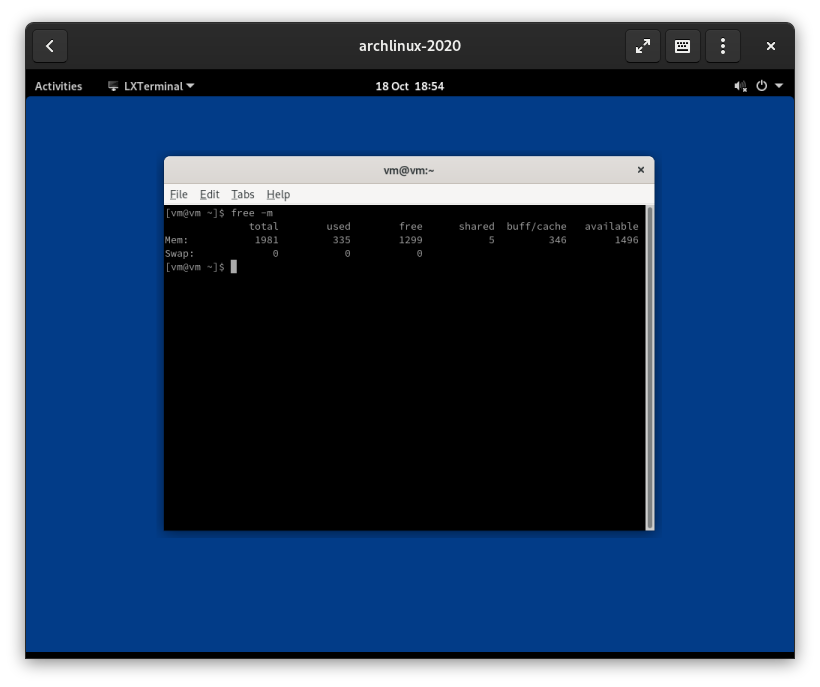

# Gnome is bloated
> Gnome on Arch by default is really bloated, it doesn't need to be this way.

By default, the gnome [group](https://www.archlinux.org/groups/x86_64/gnome/) is really bloated, it contains packages that you do not need such as [yelp](https://www.archlinux.org/packages/extra/x86_64/yelp/). I think that packages like these should not be in the Gnome group but rather in [gnome-extra](https://www.archlinux.org/groups/x86_64/gnome-extra/) as they are not needed to run Gnome. 

I made my own list of packages that you actually need to run Gnome and alternatives to packages that need a lot of dependencies for example Nautilus which has GVFS as a strong dependency even though I doubt most people will be using it and it takes up lots of resources. 

Instead of intalling Gnome normally like `pacman -S gnome`, I would reccomend installing Gnome with these packages so you do not install as much bloat.  

`pacman -S gdm gnome-control-center gnome-keyring lxterminal gpicview-gtk3 gnome-session gnome-settings-daemon gnome-shell pcmanfm-gtk3 mutter `

After installing Gnome with these options, you will have a much lighter Gnome install, like shown in this image.

